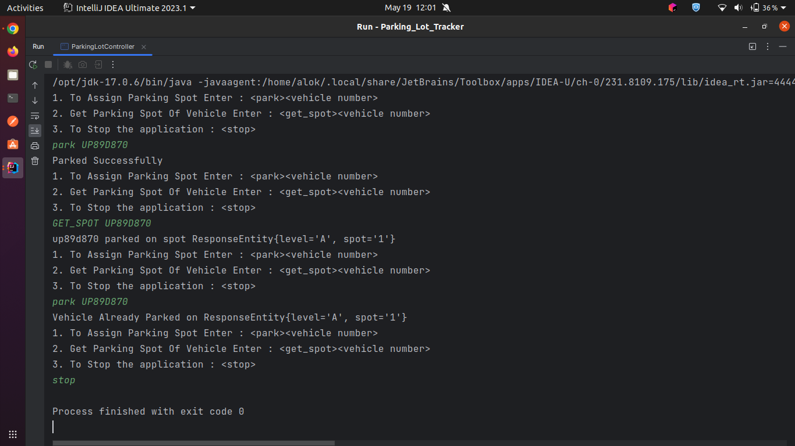

### How to run this application
#### Run ParkingLotController file
- To Assign Parking Spot
  - park {vehicleNumber} 
    - park MH78D8978

- Get Parking Spot Of Vehicle
  - get_spot {vehicle number}
    - get_spot MH78D8978

- To Stop Application
  - stop

